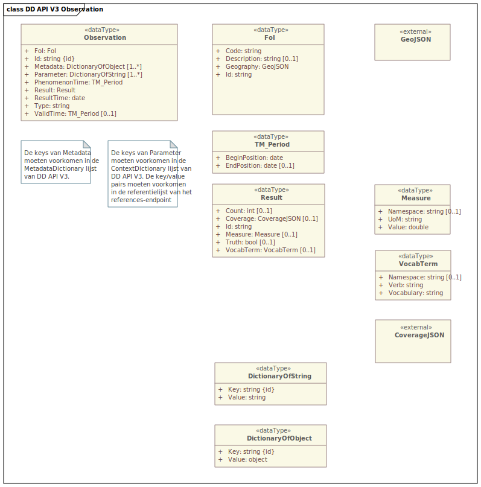

# Datamodellen (Observation)

Dit hoofdstuk beschrijft het datamodel van DD API V3, gebaseerd op een subset van de OGC [OM&S](#dfn-oms) standaard.

Dit beschrijft de JSON-representatie van een observatie.

Vet is verplicht. Italic (schuingedrukt) is verplicht onder bepaalde omstandigheden.

Een JSON-schema voor het observation type is [hier](./definitions/v3.0/json-schema/observation.schema.json) beschikbaar.

Het gehele OData response in JSON-schema voor het `/v3/odata/observations` endpoint is [hier](./definitions/v3.0/json-schema/odata.observation.schema.json) beschikbaar.

## Observation
Observation beschrijft de omstandigheden en de resultaten van een observatie.

| Eigenschap         | Type                    | Omschrijving                                                                                 |
|--------------------|-------------------------|----------------------------------------------------------------------------------------------|
| **Id**             | string                  | Unieke id van de observatie.                                                                 |
| **ResultTime**     | string                  | Datum en tijd waarop het resultaat beschikbaar is gekomen, in ISO8601 formaat. Het geeft aan |
| **PhenomenonTime** | [Tm_Period](#Tm_Period) | Periode waarin is gemeten/bemonsterd. Begin- en EndPosition zijn in ISO8601 formaat.         |
| ValidTime          | [Tm_Period](#Tm_Period) | Geldigheidsperiode van de data.                                                              |
| **FoI**            | [FoI](#FoI)             | Feature of Interest: in DD API V3 altijd geolocatie van de observatie.                       |
| **Parameter**      | [Parameter](#parameter) | Beschrijft de omstandigheden van de observatie.                                              |
| **Metadata**       | [Metadata](#metadata)   | Extra informatie over de observatie.                                                         |
| **Result**         | [Result](#result)       | Resultaat.                                                                                   |

## Tm_Period

Beschrijft een periode met begin- en einddatum.

| Eigenschap        | Type   | Omschrijving                                                                                     |
|-------------------|--------|--------------------------------------------------------------------------------------------------|
| **BeginPosition** | string | Begin van de periode in ISO8601 formaat.                                                         |
| _EndPosition_     | string | Eind van de periode in ISO8601 formaat. Verplicht voor _PhenomenonTime_, optioneel voor de rest. |

## FoI

In DD API V3 is FoI (Feature of Interest) altijd een geolocatie.

| Eigenschap      | Type    | Omschrijving                          |
|-----------------|---------|---------------------------------------|
| **Id**          | string  | Uniek Id van de meetlocatie.          |
| **Code**        | string  | Code van de meetlocatie.              |
| **Description** | string  | Beschrijving van de meetlocatie.      |
| **Geography**   | GeoJSON | GeoJSON behorende bij de meetlocatie. |

## Parameter

Parameter volgens [OM&S](#dfn-oms) is een dictionary van key/value pairs.

In DD API V3 is value altijd een string, waarbij geldt dat de combinatie van key en value uniek is per observatie,
maar ook dat die combinatie **zoveel mogelijk** overeenkomt met de Aquo-termen, maar die combinatie moet ook voorkomen in de data van het referentie-endpoint.

De keys moeten altijd conform de [DD API V3 definitielijst voor parameters](./definitions/ContextDefinitions.csv) zijn.

## Metadata

Metadata bevat alle extra informatie over de observatie, die niet gestandaardiseerd is, zoals ordernummer van een opdracht.

De keys moeten altijd conform de [DD API V3 definitielijst voor metadata](./definitions/MetadataDefinitions.csv) zijn.

Er is één verplichte waarde in Metadata: `modifiedOn`, wat aangeeft wat de laatste datum (aanmaak of wijziging) is in ISO8601 formaat.

## Result

Result is het resultaat van een observatie.

Het formaat van Result is afhankelijk de type van de observatie.

| Eigenschap | Type             | Omschrijving                                                                      |
|------------|------------------|-----------------------------------------------------------------------------------|
| **Id**     | string           | Uniek Id van de meetlocatie.                                                      |
| Truth      | string           | De waarde van de observatie, indien Type is Truth. Mogelijke waarden: True, False |
| Vocab      | [Vocab](#vocab)  | De waarde van de observatie, indien Type is Vocab.                                |
| Count      | integer          | De waarde van de observatie, indien Type is Count. Een geteld, geheel getal.      |
| Coverage   | [[CoverageJSON]] | De waarde van de observatie, indien Type is Coverage.                             |

## Measure

Gemeten waarde met eenheid.

| Eigenschap | Type          | Omschrijving                                                |
|------------|---------------|-------------------------------------------------------------|
| **Unit**   | string        | Eenheid van de observatie. Waar mogelijk, een Aquo eenheid. |
| **Value**  | float/decimal | Waarde van de observatie.                                   |
| Namespace  | string        | Bron voor de definitie. Indien leeg, Aquo.                  |

## Vocab

Onderwerp/waarde combinatie (classificatie).

| Eigenschap     | Type         | Omschrijving                               |
|----------------|--------------|--------------------------------------------|
| **Vocabulary** | string       | Woordenboek (naam van de Aquo domeintabel) |
| **Verb**       | string       | Woord (definitie) binnen de vocabulary.    |
| Namespace      | string       | Bron voor de definitie. Indien leeg, Aquo. |

## CoverageJSON

Voor tijdreeksen wordt gebruik gemaakt van [#dfn-coveragejson] formaat.
Voor DD API V3 zijn er aan implementeren van een correcte CoverageJSON een aantal eisen gesteld:

- Voor sensoren wordt aangeraden om een tijdreeks te hebben met de naam van een Aquo waarnemingssoort.
  Dit zorgt ervoor dat eenvoudig een selectie kan plaatsvinden.
- PhenomenonTime/BeginPosition en PhenomenonTime/EndPosition moeten overeenkomen met het datum-bereik van tenminste één van de tijdreeksen.
- Metadata/ModifiedOn moet overeenkomen met de laatste wijzigingsdatum van de data.

## DD API V3 Observation UML

<figure>
<figcaption>DD API V3 Observation UML</figcaption>
</figure>
