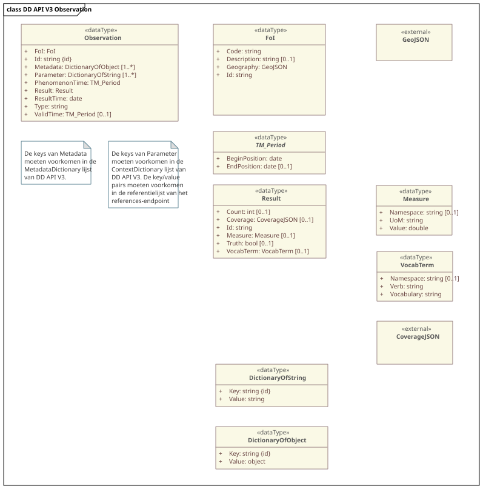

# **Virtuele** Datamodellen (Observation)

<aside class="advisement" title="Virtueel model">
De modellen in dit hoofdstuk zijn virtueel. 
Ze beschrijven uitsluitend de structuur van de data zoals deze door de API wordt uitgewisseld. 
Een implementatie hoeft deze structuur intern niet als opslagmodel te gebruiken; de aanbieder is vrij in de keuze van database-technologie en mapt de eigen bronnen on-the-fly naar dit virtuele model.
</aside>

<aside class="advisement" title="HTTP-methoden en statuscodes">
DD API V3 volgt de REST API Design Rules (Nederlandse API-strategie) voor het gebruik van HTTP-methoden en statuscodes. 
De hier beschreven keuzes voor POST, PUT, DELETE en de bijbehorende statuscodes zijn in lijn met de aanbevelingen van deze richtlijnen.
</aside>

Dit hoofdstuk beschrijft het datamodel van DD API V3, gebaseerd op een subset van de OGC [[OM&S]] standaard.

Dit beschrijft de JSON-representatie van een observatie.

Het formaat dat DD API V3 gebruikt is een **technisch uitwisselingsformaat** in JSON encoding, met JSON Schema als normatieve specificatie. 
Dit betreft niveau 4 (fysiek/technisch datamodel) volgens het MIM-lagenmodel, wat expliciet buiten de scope van MIM valt. 
MIM is bedoeld voor conceptuele en logische informatiemodellen (niveau 1-3), niet voor REST API-berichtformaten.

Vet is verplicht. Italic (schuingedrukt) is verplicht onder bepaalde omstandigheden.

Een JSON-schema voor het observation type is [hier](https://github.com/DigitaleDeltaOrg/DD-API-V3-ReSpec/raw/refs/heads/main/main/definitions/v3.0/json-schema/observation.schema.json) beschikbaar.

Het gehele OData response in JSON-schema voor het `/v3/odata/observations` endpoint is [hier](https://github.com/DigitaleDeltaOrg/DD-API-V3-ReSpec/tree/main/definitions/v3.0/json-schema/odata.observation.schema.json) beschikbaar.

## Observation
Observation beschrijft de omstandigheden en de resultaten van een observatie.

| Eigenschap         | Type                    | Omschrijving                                                                                                                                        |
|--------------------|-------------------------|-----------------------------------------------------------------------------------------------------------------------------------------------------|
| **Id**             | string                  | Unieke id van de observatie.                                                                                                                        |
| **ResultTime**     | string                  | Datum en tijd waarop het resultaat beschikbaar is gekomen, in ISO8601 formaat. Het geeft aan wanneer het resultaat is opgenomen in het bronsysteem. |
| **PhenomenonTime** | [Tm_Period](#Tm_Period) | Periode waarin is gemeten/bemonsterd. Begin- en EndPosition zijn in ISO8601 formaat.                                                                |
| ValidTime          | [Tm_Period](#Tm_Period) | Geldigheidsperiode van de data.                                                                                                                     |
| **FoI**            | [FoI](#FoI)             | Feature of Interest: in DD API V3 altijd geolocatie van de observatie. Geeft aan _waar_ gemeten is.                                                 |
| **Parameter**      | [Parameter](#parameter) | Beschrijft de omstandigheden van de observatie: _wat_ en _waarmee_ er gemeten is.                                                                   |
| **Metadata**       | [Metadata](#metadata)   | Extra informatie over de observatie, ongeklassificeerd, zoals ordernummer.                                                                          |
| **Result**         | [Result](#result)       | Resultaat: de _uitkomst_ van de observatie.                                                                                                         |

## Tm_Period

Beschrijft een periode met begin- en einddatum.

| Eigenschap        | Type   | Omschrijving                                                                                     |
|-------------------|--------|--------------------------------------------------------------------------------------------------|
| **BeginPosition** | string | Begin van de periode in ISO8601 formaat.                                                         |
| _EndPosition_     | string | Eind van de periode in ISO8601 formaat. Verplicht voor _PhenomenonTime_, optioneel voor de rest. |

## FoI

In DD API V3 is FoI (Feature of Interest) altijd een geolocatie.

| Eigenschap      | Type    | Omschrijving                          |
|-----------------|---------|---------------------------------------|
| **Id**          | string  | Uniek Id van de meetlocatie.          |
| **Code**        | string  | Code van de meetlocatie.              |
| **Description** | string  | Beschrijving van de meetlocatie.      |
| **Geography**   | GeoJSON | GeoJSON behorende bij de meetlocatie. |

## Parameter

Parameter volgens [[OM&S]] is een dictionary van key/value pairs.

In DD API V3 is value altijd een string, waarbij geldt dat de combinatie van key en value uniek is per observatie,
maar ook dat die combinatie **zoveel mogelijk** overeenkomt met de Aquo-termen, maar die combinatie moet ook voorkomen in de data van het referentie-endpoint.

De keys moeten altijd conform de [DD API V3 definitielijst voor parameters](https://github.com/DigitaleDeltaOrg/DD-API-V3-ReSpec/tree/main/definitions/ContextDefinitions.csv) zijn.

## Metadata

Metadata bevat alle extra informatie over de observatie, die niet gestandaardiseerd is, zoals ordernummer van een opdracht.

De keys moeten altijd conform de [DD API V3 definitielijst voor metadata](https://github.com/DigitaleDeltaOrg/DD-API-V3-ReSpec/tree/main/definitions/MetadataDefinitions.csv) zijn.

Er is één verplichte waarde in Metadata: `ModifiedOn`, wat aangeeft wat de laatste datum (aanmaak of wijziging) is in ISO8601 formaat.

## Result

Result is het resultaat van een observatie.

Het formaat van Result is afhankelijk van het type van de observatie.  

| Eigenschap | Type                | Omschrijving                                                                                                                   |
|------------|---------------------|--------------------------------------------------------------------------------------------------------------------------------|
| **Id**     | string              | Uniek Id van het resultaat (_mag_ gelijk zijn aan het Id van de observatie).                                                   |
| Truth      | string              | Wanneer het resultaat een waarheid representeerd (waar/onwaar, true/false).                                                    |
| Vocab      | [Vocab](#vocab)     | Wanneer het een `typering` betreft.                                                                                            |
| Count      | integer             | Pure 'telling', bijvoorbeeld onder een microscoop, altijd een heel getal.                                                      |
| Coverage   | [[CoverageJSON]]    | Tijdreeksen of verwachtingen.                                                                                                  |
| Measure    | [Measure](#measure) | Waarde/eenheid combinatie.                                                                                                     |

#### Hulp bij interpretatie voor IM Metingen

IM Metingen hanteert een andere terminologie dan [[OM&S]]. Waar IM Metingen specifieke velden heeft voor typering en grootheid (en alfanumerieke waarde), zijn dat in [[OM&S]] andere soorten Results.  

##### Wanneer het een IM Metingen `Typering` betreft

Gebruik type [Vocab](#vocab). De `Vocabulary` (woordenlijst) daarin wordt dan gelijk aan de code van de typering en `Verb` (woord) wordt gelijk aan de alfanumerieke waarde die binnen die typering gebruikt kan worden.
Indien deze definitie van Aquo afkomstig is, dan _mag_ de namespace leeg blijven. Anders moet die gevuld worden met de code voor het bronsysteem die de typering definiëert.

##### Wanneer het een IM Metingen `Grootheid` betreft

- Wanneer het een fysieke telling betreft (dus gehele getallen), dan _mag_ het type `Count` worden gebruikt. Dit impliceert dat de eenheid volgens Aquo termen `AANTL` (Aantal) is.
- Gebruik anders type [Measure](#measure).

## Measure

Gemeten waarde met eenheid.

| Eigenschap | Type          | Omschrijving                                                |
|------------|---------------|-------------------------------------------------------------|
| **Unit**   | string        | Eenheid van de observatie. Waar mogelijk, een Aquo eenheid. |
| **Value**  | float/decimal | Waarde van de observatie.                                   |
| Namespace  | string        | Bron voor de definitie. Indien leeg, Aquo.                  |

## Vocab

Onderwerp/waarde combinatie (classificatie).

| Eigenschap     | Type   | Omschrijving                               |
|----------------|--------|--------------------------------------------|
| **Vocabulary** | string | Woordenboek (naam van de Aquo domeintabel) |
| **Verb**       | string | Woord (definitie) binnen de vocabulary.    |
| Namespace      | string | Bron voor de definitie. Indien leeg, Aquo. |

## CoverageJSON

Voor tijdreeksen wordt gebruik gemaakt van [[CoverageJSON]] formaat.
Voor DD API V3 zijn er aan implementeren van een correcte CoverageJSON een aantal eisen gesteld:

- Voor sensoren wordt aangeraden om een tijdreeks te hebben met de naam van een Aquo waarnemingssoort.
  Dit zorgt ervoor dat eenvoudig een selectie kan plaatsvinden.
- PhenomenonTime/BeginPosition en PhenomenonTime/EndPosition moeten overeenkomen met het datum-bereik van tenminste één van de tijdreeksen.
- Metadata/ModifiedOn **moet** overeenkomen met de laatste wijzigingsdatum van de data.

## DD API V3 Observation UML

<figure>
<figcaption>DD API V3 Observation Model - Illustratief UML diagram</figcaption>
</figure>
