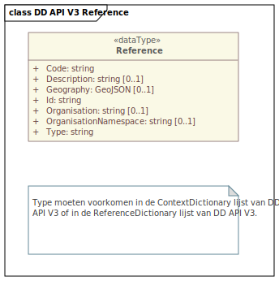

# Datamodellen (Reference)

Dit hoofdstuk beschrijft een basismodel voor referenties van DD API V3.

Vet is verplicht.

Een JSON-schema voor het reference type is [hier](./definitions/v3.0/json-schema/reference.schema.json) beschikbaar.

Het gehele OData response in JSON-schema voor het `/v3/odata/references` endpoint is [hier](./definitions/v3.0/json-schema/odata.reference.schema.json) beschikbaar.

## Reference

| Eigenschap            | Type    | Omschrijving                                                                    |
|-----------------------|---------|---------------------------------------------------------------------------------|
| **Id**                | string  | Id van de referentie.                                                           |
| **Type**              | string  | Soort referentie.                                                               |
| **Organisation**      | string  | Naam van de organisatie.                                                        |
| OrganisationNamespace | string  | Code van de organisatie volgens Aquo.                                           |
| **Code**              | string  | Begin en eind van het evenement. Begin- en EndPosition zijn in ISO8601 formaat. |
| **Description**       | string  | Geldigheidsperiode van de data.                                                 |
| Geography             | GeoJSON | Verplicht by type = "MeasurementObject" (meetobject).                           |

## DD API V3 Reference UML

<figure>
<figcaption>DD API V3 Reference UML</figcaption>
</figure>

Type **moet** voorkomen in [ContextDefinitions.csv](./definitions/ContextDefinitions.csv) óf in [ReferenceDictionaries.csv](./definitions/ReferenceDefinitions.csv).

De combinatie van **Type** en **Code** moet uniek zijn.
In sommige omstandigheden kan de combinatie van **Type** en **Code** niet uniek zijn. In dat geval moet **Organisation** worden toegevoegd om de combinatie uniek te maken.

Data in Reference kan worden uitgebreid met extra eigenschappen, afhankelijk van de implementatie. Denk daarbij aan een LinkedData-referentie.

_Een LinkedData-referentie zal in versie 4 van DD API worden toegevoegd._

