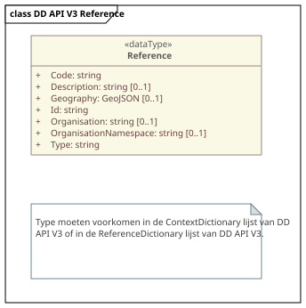

# **Virtuele** Datamodellen (Reference)

<aside class="advisement" title="Virtueel model">
De modellen in dit hoofdstuk zijn virtueel. 
Ze beschrijven uitsluitend de structuur van de data zoals deze door de API wordt uitgewisseld. 
Een implementatie hoeft deze structuur intern niet als opslagmodel te gebruiken; de aanbieder is vrij in de keuze van database-technologie en mapt de eigen bronnen on-the-fly naar dit virtuele model.
</aside>

Dit hoofdstuk beschrijft een basismodel voor referenties van DD API V3.

Vet is verplicht.

Een JSON-schema voor het reference type is [hier](https://github.com/DigitaleDeltaOrg/DD-API-V3-ReSpec/tree/main/definitions/v3.0/json-schema/reference.schema.json) beschikbaar.

Het formaat dat DD API V3 gebruikt is een **technisch uitwisselingsformaat** in JSON encoding, met JSON Schema als normatieve specificatie. Dit betreft niveau 4 (fysiek/technisch datamodel) volgens het MIM-lagenmodel, wat expliciet buiten de scope van MIM valt. MIM is bedoeld voor conceptuele en logische informatiemodellen (niveau 1-3), niet voor REST API-berichtformaten.

Het gehele OData response in JSON-schema voor het `/v3/odata/references` endpoint is [hier](https://github.com/DigitaleDeltaOrg/DD-API-V3-ReSpec/tree/main/definitions/v3.0/json-schema/odata.reference.schema.json) beschikbaar.

## Reference

| Eigenschap            | Type    | Omschrijving                                          |
|-----------------------|---------|-------------------------------------------------------|
| **Id**                | string  | Id van de referentie.                                 |
| **Type**              | string  | Soort referentie.                                     |
| **Organisation**      | string  | Naam van de organisatie.                              |
| OrganisationNamespace | string  | Code van de organisatie volgens Aquo.                 |
| **Code**              | string  | Code van de entiteit.                                 |
| **Description**       | string  | Omschrijving van de entiteit.                         |
| Geography             | GeoJSON | Verplicht by type = "MeasurementObject" (meetobject). |

## DD API V3 Reference UML

<figure>
<figcaption>DD API V3 Reference UML</figcaption>
</figure>

`Type` **MOET** voorkomen in [ContextDefinitions.csv](https://github.com/DigitaleDeltaOrg/DD-API-V3-ReSpec/tree/main/definitions/ContextDefinitions.csv) óf in [ReferenceDictionaries.csv](https://github.com/DigitaleDeltaOrg/DD-API-V3-ReSpec/tree/main/definitions/ReferenceDefinitions.csv) óf in [MetadataDictionaries.csv](https://github.com/DigitaleDeltaOrg/DD-API-V3-ReSpec/tree/main/definitions/MetadataDefinitions.csv).

De combinatie van `Type`, `Code` en `Organisation` moeten uniek zijn binnen het systeem. 

Data in Reference kan worden uitgebreid met extra eigenschappen, afhankelijk van de implementatie.

_Een LinkedData-referentie zal in versie 4 van DD API worden toegevoegd._

